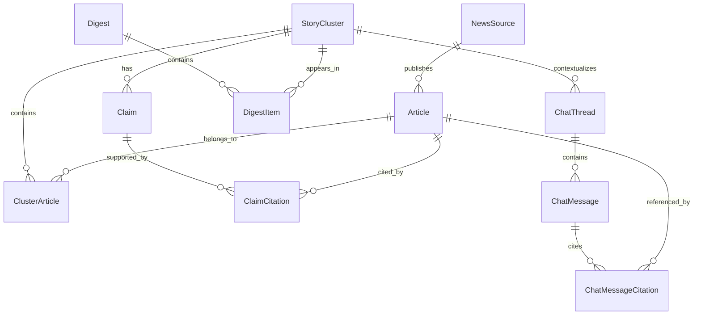

# 数据模型约定（Beta v1）

本文件是后续 Prisma Schema、数据库迁移和 API 实现的单一依据。所有时间字段使用 UTC；主键使用 UUID；新闻内容只保存必要元数据和合规短摘录，不保存或重新发布全文。

## 设计原则

- `StoryCluster`（新闻事件）是产品的核心实体：同一事件的多篇报道聚合到同一个事件中。
- 每条用于首页或问答的可核验事实都以 `Claim` 表达，并至少关联一个 `ClaimCitation`。
- `Digest` 是按日期发布的不可变版本；改版时新增版本，不覆盖已发布内容。
- 匿名对话始终绑定一个 `StoryCluster`，仅保存匿名会话哈希，不保存用户身份信息。
- 仅 `PUBLISHED` 状态的事件、日报和已验证事实可直接面向用户展示。

## 实体关系

## 枚举

| 枚举 | 值 | 用途 |
| --- | --- | --- |
| `SourceKind` | `OFFICIAL`、`WIRE`、`MEDIA` | 来源类型 |
| `ArticleLanguage` | `ZH`、`EN`、`OTHER` | 文章语言 |
| `ArticleStatus` | `ACTIVE`、`SUPPRESSED` | 是否允许继续使用文章 |
| `StoryStatus` | `CANDIDATE`、`REVIEW`、`PUBLISHED`、`ARCHIVED` | 事件处理与发布状态 |
| `ClaimKind` | `FACT`、`ANALYSIS` | 可核验事实或带限定条件的分析 |
| `ClaimStatus` | `DRAFT`、`VERIFIED`、`DISPUTED`、`REJECTED` | 事实审核状态 |
| `DigestStatus` | `DRAFT`、`PUBLISHED`、`SUPERSEDED` | 日报版本状态 |
| `ChatMessageRole` | `USER`、`ASSISTANT`、`SYSTEM` | 对话消息角色 |

## 核心实体

### `NewsSource`

受控新闻来源白名单。

| 字段 | 说明 | 约束 |
| --- | --- | --- |
| `id` | UUID 主键 | 主键 |
| `name` | 来源名称 | 非空 |
| `domain` | 来源主域名 | 唯一 |
| `kind` | 来源类型 | `SourceKind` |
| `trustScore` | 初始可信度权重，范围 0–100 | 默认 50 |
| `isEnabled` | 是否参与采集 | 默认 `true` |
| `createdAt` / `updatedAt` | 审计时间 | 非空 |

### `Article`

一条已标准化的外部报道，仅保存可用于溯源的元数据和短摘录。

| 字段 | 说明 | 约束 |
| --- | --- | --- |
| `id` | UUID 主键 | 主键 |
| `sourceId` | 所属来源 | 外键 → `NewsSource` |
| `canonicalUrl` | 去除追踪参数后的原文链接 | 唯一 |
| `externalId` | 来源提供的稳定 ID，可为空 | 与来源组成唯一索引 |
| `title` | 原始标题 | 非空 |
| `excerpt` | 合规短摘录，可为空 | 不存全文 |
| `publishedAt` | 原文发布时间 | 非空、索引 |
| `language` | 文章语言 | `ArticleLanguage` |
| `contentHash` | 标题、时间、摘录形成的去重哈希 | 索引 |
| `status` | 文章可用状态 | `ArticleStatus`，默认 `ACTIVE` |
| `ingestedAt` | 采集时间 | 非空 |
| `createdAt` / `updatedAt` | 审计时间 | 非空 |

### `StoryCluster`

一个独立国际事件，是首页卡片、引用档案和问答上下文的共同载体。

| 字段 | 说明 | 约束 |
| --- | --- | --- |
| `id` | UUID 主键 | 主键 |
| `headline` | 事件标题 | 非空 |
| `summary` | 面向用户的简短摘要 | 可为空，发布前必填 |
| `whyItMatters` | 影响说明 | 可为空，发布前必填 |
| `importanceScore` | 事件重要性分数 | 默认 0、索引 |
| `status` | 事件状态 | `StoryStatus`，默认 `CANDIDATE` |
| `startedAt` | 已知最早发生时间 | 可为空 |
| `lastEventAt` | 最近进展时间 | 可为空、索引 |
| `createdAt` / `updatedAt` | 审计时间 | 非空 |

### `ClusterArticle`

文章与事件的多对多关系，保留聚类置信度和人工修订结果。

| 字段 | 说明 | 约束 |
| --- | --- | --- |
| `storyId` | 事件 ID | 外键 → `StoryCluster` |
| `articleId` | 文章 ID | 外键 → `Article` |
| `relevanceScore` | 与事件的关联分数 | 0–1 |
| `isPrimary` | 是否为事件主来源 | 默认 `false` |
| `createdAt` | 建立关联时间 | 非空 |

复合主键：`(storyId, articleId)`。

### `Claim` 与 `ClaimCitation`

`Claim` 表示摘要或答案中的一个最小可核验陈述；`ClaimCitation` 保存它与新闻证据的对应关系。

| 实体 | 字段 | 说明与约束 |
| --- | --- | --- |
| `Claim` | `id`、`storyId`、`text`、`kind`、`status`、`createdAt`、`updatedAt` | `storyId` 外键；默认 `DRAFT`；仅 `VERIFIED` 可自动发布 |
| `ClaimCitation` | `id`、`claimId`、`articleId`、`supportingExcerpt`、`citationOrder`、`createdAt` | 两个外键；`(claimId, citationOrder)` 唯一；证据摘录必须来自关联文章 |

### `Digest` 与 `DigestItem`

日报将某一天的首页内容固定为一个版本，防止事件后续更新改变历史版本。

| 实体 | 字段 | 说明与约束 |
| --- | --- | --- |
| `Digest` | `id`、`digestDate`、`revision`、`status`、`publishedAt`、`createdAt`、`updatedAt` | `(digestDate, revision)` 唯一；同一天最多一个 `PUBLISHED` 版本 |
| `DigestItem` | `id`、`digestId`、`storyId`、`position`、`headlineSnapshot`、`summarySnapshot`、`impactSnapshot`、`createdAt` | `(digestId, storyId)` 与 `(digestId, position)` 唯一；快照字段保留发布时文本 |

### `ChatThread`、`ChatMessage` 与 `ChatMessageCitation`

匿名对话仅围绕一个事件进行；助手回答使用独立引用关系保存文章依据。

| 实体 | 字段 | 说明与约束 |
| --- | --- | --- |
| `ChatThread` | `id`、`storyId`、`anonymousSessionHash`、`expiresAt`、`createdAt`、`updatedAt` | `(storyId, anonymousSessionHash)` 唯一；默认保留 14 天 |
| `ChatMessage` | `id`、`threadId`、`role`、`content`、`sequence`、`createdAt` | `(threadId, sequence)` 唯一；按序读取上下文 |
| `ChatMessageCitation` | `id`、`messageId`、`articleId`、`supportingExcerpt`、`citationOrder`、`createdAt` | `(messageId, citationOrder)` 唯一；仅助手消息可创建 |

## 数据完整性规则

1. 发布 `DigestItem` 前，其 `StoryCluster.status` 必须为 `PUBLISHED`。
2. 自动生成的首页标题、摘要和影响说明，至少应能关联到一个 `VERIFIED` 的 `Claim`；重大结论至少有两个独立来源或一个权威官方来源。
3. `Article.status = SUPPRESSED` 后，不得再作为新日报或新回答的引用；历史记录保留但标记为不可用。
4. 一个 `ChatThread` 只能访问其 `storyId` 对应的事件档案，禁止跨事件混入上下文。
5. 到达 `expiresAt` 的匿名对话及其消息、消息引用应由后台任务清理；事件、日报和文章仍按内容保留策略保存。

## 下一步映射

第 5 步将在 Prisma 中建立上述枚举、表、外键、复合唯一约束与索引，并生成第一份数据库迁移。
